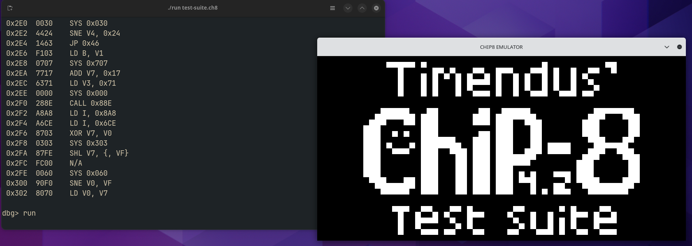
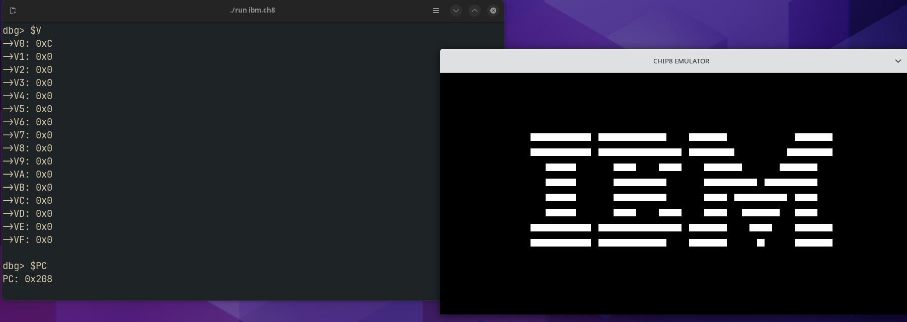

# CHIP-8 Emulator with Debugger

This project is a CHIP-8 emulator written in C, with a built-in debugger and graphical output using SDL2. CHIP-8 is a virtual machine created in the 1970s for simple games, running on early 8-bit systems. This emulator simulates the CHIP-8 environment, allowing you to load and run programs and interact with the system via a debugger.

## Features

- **CHIP-8 Emulation:** Emulates the CHIP-8 instruction set and allows running classic 8-bit games.
- **Debugger:** Includes a command-line debugger to interact with the emulator. Features include:
  - Start/stop execution.
  - View and modify registers, stack, and program counter (PC).
  - Set breakpoints, step through instructions.
  - Disassemble and inspect the program.
- **Graphics Rendering:** Uses SDL2 for graphical output, simulating the 64x32 pixel display of the CHIP-8 system.

## Screenshots





## Requirements

- **SDL2:** The emulator requires SDL2 for rendering graphics. Install SDL2 from the [official website](https://www.libsdl.org/download-2.0.php).
- **C Compiler:** The project is written in C and requires a C99 or later compatible compiler.

## How to Build and Run

### Step 1: Install SDL2

Follow the instructions on the [SDL2 download page](https://www.libsdl.org/download-2.0.php) to install SDL2.

### Step 2: Compile the Emulator

To compile, use a C compiler like `gcc`. Run the following command:

```bash
gcc main.c chip8.c instructions.c -g -lm -lSDL2 -pthread -o run
```
## Debugger Commands
- `run`: Starts execution.
- `$PC`: Displays the Program Counter.
- `$V`: Shows the general-purpose registers.
- `disas`: Disassembles and displays the instructions.
- `delay`: Sets the delay between instructions.
- `exit`: Exits the debugger.

## Work in Progress
The emulator is mostly complete, but there are still a few improvements to be made:
- Adding support for more CHIP-8 instructions.
- Enhancing debugging capabilities for a better user experience.
- Improving performance and accuracy of instruction execution.

